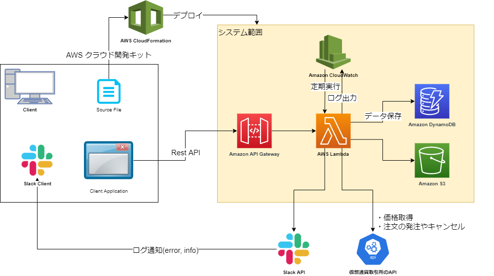

# VCAT - Virtual Currency Auto Trade

仮想通貨自動取引システム。
ゴールデンウィークの思い付きで作ったシステムです。
1分ごとにバッチ処理を実行し、各種仮想通貨を扱っている取引所のAPIと通信して自動的に仮想通貨の売買ができます。

## 使い方

「docs/manual」にまとめる予定です。…予定です。。。  
[基本](docs/manual/基本.md)を参照してください。

## インフラ構成

インフラ構成図を下記に示します。

- 基本構成は、「CloudWatch - Lambda - DynamoDB」です。CloudWatchの設定で定期的(1分ごと)にLambdaを実行します。Lambdaは、データ保存にDynamoDBを利用します。
- Lambdaは必要に応じて、SlackAPIや取引所のAPIにリクエストを送信します。
- 日次で別のLambdaが動いており、DynamoDBにためている仮想通貨の価格情報を、CSVファイルとしてS3に出力します。
- インフラ構築には、[AWS クラウド開発キット](https://aws.amazon.com/jp/cdk/)を利用しています。typescriptでインフラ定義を書いてデプロイします。
- DynamoDBの状態を直接変更できるAPIを作成しています。クライアントからAPIをたたくと、システムの状態を変更できます。(一時的に発注を中断する等)
- Lambdaの詳細については、[Lambda](#Lambda)で説明します。

## Lambda

先に示したインフラ構成図ではLambdaを1つしか書いていませんが、用途に応じて様々なLambda関数を構築しています。

- MainHandler
  - 1分ごとに定期実行するLambdaです。取引所APIから現在の価格を取得し、状況に応じて注文の発注などを行います。文字通り、メインのLambdaです。
- TransDynamoDataHandler
  - 日次で実行するLambdaです。DynamoDBの古いデータをCSVファイルにしてS3に転送します。当初はDynamoDBにデータを入れたままにしていると容量が圧迫するかなと懸念して作りましたが、実際は1年くらい放置しても大丈夫だったので、CSVファイルを作成するだけでDynamoDBからデータ削除はしていません。
- UtilBatch
  - 汎用バッチ。AWSのコンソールから手動実行する想定です。バグ修正などの際に、DynamoDBに残った邪魔な注文情報を削除したり、Context情報をリセットするために使います。好きなように機能を追加していく予定。
- API用Handler
  - APIのエンドポイントごとに、それ用のLambdaを用意しています。

## ソースファイルの読み方

- 本プロジェクトは、[AWS クラウド開発キット](https://aws.amazon.com/jp/cdk/)(AWS-CDK)で開発しています。
- AWS-CDKのエントリーポイントは、[vc-auto-trade.ts](src/bin/vc-auto-trade.ts)です。
  - この中で、本番環境/開発環境に応じて、[vc-auto-trade-stack.ts](src/lib/vc-auto-trade-stack.ts)と[vc-auto-trade-stack-dev.ts](src/lib/vc-auto-trade-stack-dev.ts)のクラスにあるコンストラクタを呼び出しています。
- いずれのクラスも、コンストラクタの処理は[stackConstructor.ts](src/lib/stackConstructor.ts)で記述しています。ここで、インフラ構成図で黄色で示したAWS上に構築するインフラを定義しています。
- Lambdaの「MainHandler」の処理のエントリーポイントは、[main.ts](src/lib/lambda/Handler/main.ts)です。
- lib/lambdaの下にLambdaで実行するコードが配置してあります。大まかなフォルダ構成は下記の通りです。
  - Common…共通処理。（ログ出力等）
  - HandleError…エラー処理。
  - Handler…Lambdaのエントリーポイントをまとめています。
  - Interfaces…他のAWSリソース(DynamoDBやS3)とのアクセスや、SlackAPI、取引所APIとの通信を記述します。
  - Main…Lambdaの「MainHandler」の処理。
  - UtilBatch…Lambdaの「UtilBatch」の処理。
