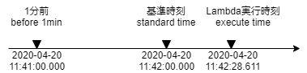
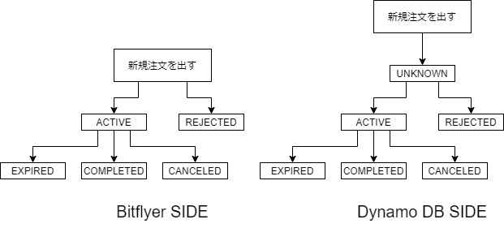

# 詳細設計書

メインのLambda関数(コントローラー)の処理概要を記載する。

## 基準時刻について

本書では、基準時刻という単語を用いる。基準時刻とは、Lambda関数を実行した時刻から、秒以下を切り捨てて分単位にした時刻を指す。下図を参照。

## 外部とのインターフェース

コントローラーは下記のインターフェースと通信する。

- Exchange API(取引所API)…仮想通貨取引所のAPI。約定履歴や注文情報を取得したり、注文を発注・キャンセルする。
- DynamoDB…様々な情報を保存しておく、本システムの永続ストレージ。

## フェーズ

コントローラーの処理は大きく分けて4つのフェーズに分かれる。

- 稼働確認フェーズ
  - Exchange APIの稼働状況を確認する。動いてなかったら、処理をスキップする。
- 取得フェーズ
  - DynamoDBとExchange APIを通じて処理に必要な情報を取得する。
- 処理フェーズ
  - 取得した情報をもとに、注文の発行やキャンセルを行い、処理結果を保存フェーズに渡す。
- 保存フェーズ
  - 処理の結果や必要な情報などを、DynamoDBに保存する。

## 型定義とフェーズ間のインターフェース

本節では、データ型の観点から各フェーズの入出力を整理する。

### 主要なデータ型

ここでは、コントローラーの処理に出てくるデータ型の説明を行う。記述レベルは概要にとどめ、詳しいプロパティなどは実装のコメントを見ること。実装は[DomainType.ts](../../src/lib/lambda/Interfaces/DomainType.ts)を参照。

- 注文(Order)…本システムが発注した注文を表す。注文の状態は本システム側のDBとBitflyer側の二重管理となり、処理フェーズでBitflyer側の情報からDB側への同期処理を行う。下記に注文の状態遷移図を示す。
- 約定(Execution)…Bitflyer上で発生した取引を表す。取得フェーズでBitflyer側から取得し、処理フェーズで次の集計約定に変換する。
- 集計約定(AggregatedExecution)…約定を一定の期間(10秒や1時間等)で平均などをとったデータ。処理フェーズで作成し、注文の判断に使う。また、次回以降でも使うため、保存フェーズでDBに保存する。
- 資産残高(Balance)…仮想通貨や日本円の残高情報。総資産と利用可能額(総資産額から、買い注文や売り注文でマーケットに実質取られている分を除いた額)を持つ。

### フェーズ間のインターフェース

ここでは、各フェーズの入出力インターフェースを整理する。どのフェーズも、最終目標は「処理フェーズでより良く注文を出すこと」なので、ここに着目すると整理しやすい。

- 入力フェーズ→処理フェーズ
  - 約定のリスト
    - 「基準時刻の1分前」以降の約定履歴の一覧。取引所APIから取得する。
  - 短期集計約定リスト
    - DynamoDBから取得する。10秒間隔で集計した集計約定のリスト。「基準時刻の2時間前」～「基準時刻の1分前」の期間で取得。
  - 長期集計約定リスト
    - DynamoDBから取得する。1時間間隔で集計した集計約定のリスト。「基準時刻の7日前」～「基準時刻」の期間で取得。
  - 注文情報のリスト
    - DynamoDB上でACTIVEまたはUNKOWN状態となっている注文情報と、それに対応する取引所APIから取得した注文情報のセット。
  - 資産残高のリスト
    - 取引所APIから取得した、資産残高のリスト。
- 処理フェーズ→保存フェーズ
  - 新規の短期集計約定リスト
    - 新規追加分の短期集計約定リスト。「基準時刻の1分前」～「基準時刻」の期間について、10秒間隔で集計した約定のリスト。
  - 更新後の注文情報
    - 取引所APIの情報をもとにアップデートした注文情報のリスト。DynamoDBの情報を更新する。
- 取得フェーズ→保存フェーズ
  - 短期集計約定リスト
    - 長期集計のために利用する。
  - 長期集計約定リスト
    - 長期集計の判定に利用する。

## 処理詳細

本節では、各フェーズの処理詳細を記載する。

### 稼働確認フェーズ

TODOとして残す。後で実装する。

### 取得フェーズ

下記の5つの処理を非同期で実施する。

- 約定リストの取得  
  取引所APIから約定リストを取得する。
- 短期集計約定リストの取得  
  DynamoDBから短期集計約定リストを取得する。「基準時刻の1分前」以降のデータを全て取得する。
- 長期集計約定リストの取得  
  DynamoDBから長期集計約定リストを取得する。「基準時刻の1週間前」以降のデータを全て取得する。
- 注文リストの取得
  - DynamoDBからUNKNWON、ACTIVE状態の注文を取得する。
  - 取得した各注文に対して、Exchange APIから現在の状態を取得し、上書きが必要であれば上書きする。
- 資産残高リストの取得  
  取引所APIから資産残高のリストを取得。

### 処理フェーズ

処理フェーズは、大きく分けると3つの段階に分かれる。

- データ加工：入力フェーズで取得したデータを、後のために使いやすい形に変換する。
- 入力チェック：現在の入力データであれば、発注・状態管理を実施してよいか判定する。
- 発注・状態管理：加工した入力データをもとに、発注やキャンセルを行い、それらの結果の管理を行う。

処理フェーズは、下記の処理を同期的に実行する。

- データ加工
  - 約定の短期集計処理
    - 直近の約定データ(基準時刻～基準時刻の1分前)を、10秒間隔で集計する。
  - 約定の長期集計処理
    - DBから取得した長期集計に直近の長期集計が無い場合、それを短期集計約定から集計して作成する。
    - 直近の長期集計とは、基準時刻を分までの時間で切り捨てた1時間。例えば、Lambda実行が9時27分10秒なら、8時～9時のデータを指す。
- 入力チェック
  - 取得した未完了の注文(Unknown, Active)に対し、管理対象外の注文がないか確認する。
- 発注・状態管理
  - 発注中の場合、下記の処理を実施する。詳細な状態遷移は別に記載する。
    - 発注した注文が約定した場合(StateがCompleted)、次の状態に遷移する。
    - 発注した注文が失敗した場合(StateがInvalid)、前の状態に遷移する。
  - 現在の注文状態をもとに、発注判断と状態管理を行う。詳細は省略。

#### 注文状態

注文状態は、次の2つのプロパティで管理される。
このプロパティは、ProductContextで管理し、各バッチ処理の開始時/終了時に、DBから取得・DBに保存する。

- OrderPhase: 注文フェーズ。下記の4状態をとる。詳細は、[DomainType.ts](../../src/lib/lambda/Interfaces/DomainType.ts)を参照。
  - Buy
  - Sell
  - StopLoss
  - Wait
- afterSendOrder: 発注前と発注後を区別する。trueだと発注後。

これらの状態遷移は、下記のようになる。（気が向いたら状態遷移図を作ろう。だいぶ整理できてるし…）

| 前状態(OrderPhase, afterSendOrder) | 後状態(OrderPhase, afterSendOrder) | 条件 |
|:--|:--|:--|
| (Wait, *) | (Buy, false) | 待機を解除する。 |
| (Buy, false) | (Buy, true) | 買いの判断が出て、買い注文を出す。 |
| (Buy, true) | (Buy, false) | 買い注文が失敗する。 |
| (Buy, true) | (Sell, false) | 買い注文が約定する。 |
| (Sell, false) | (Sell, true) | 売り注文を出す。 |
| (Sell, true) | (Sell, false) | 売り注文が失敗する。 |
| (Sell, true) | (Buy, false) | 売り注文が約定する。 |
| (Sell, true) | (StopLoss, true) | 損切の判断が出て、売り注文を取り消し損切注文を出す。 |
| (StopLoss, true) | (StopLoss, false) | 損切注文が失敗する。 |
| (StopLoss, true) | (Wait, false) | 損切注文が約定する。 |
| (StopLoss, false) | (StopLoss, true) | 損切注文を出す。 |

### 保存フェーズ

下記の処理を非同期で実施する。

- 最新の短期集計約定リストを保存。
- 長期集計約定リストの更新。
  - 「長期基準時刻の1時間前」の長期集計約定がない場合、短期集計約定リストから計算して保存する。
- 注文情報の更新
- コンテキストの更新
  - 最新の約定リストをもとに、基準時刻より手前の約定のうち、最も新しい約定のIDを控える。
